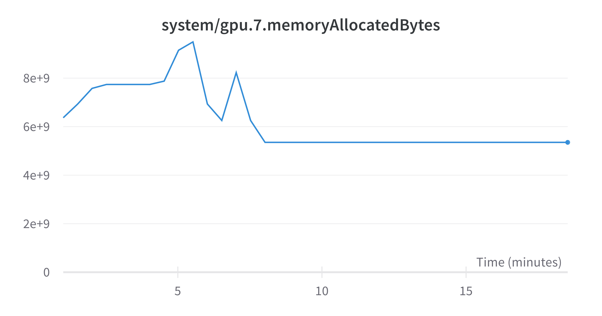
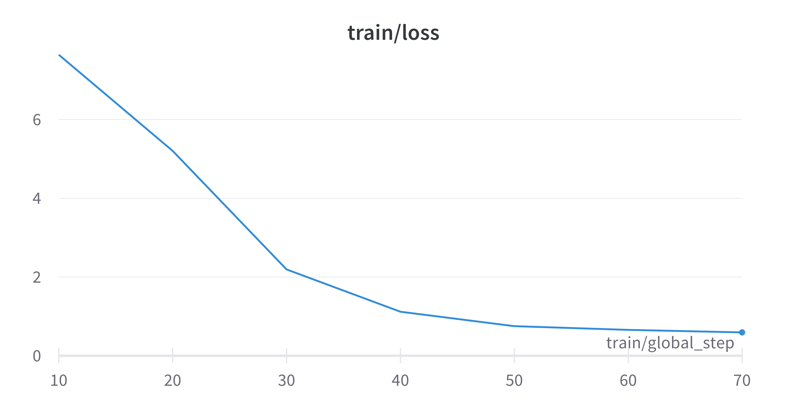

# Model Details

Base Model: [Ziya](https://huggingface.co/IDEA-CCNL/Ziya-LLaMA-13B-v1)

Model Param: 13B

# Techniques We Used

## LoRA: Low-Rank Adaptation of Large Language Models

This is a method to effectively reduce the trainable parameters, which enable this model can be trained on only one GPUs machine.

## Deepspeed: 

DeepSpeed offers a confluence of system innovations, that has made large scale DL training effective, and efficient, greatly improved ease of use, and redefined the DL training landscape in terms of scale that is possible. These innovations such as ZeRO, 3D-Parallelism, DeepSpeed-MoE, ZeRO-Infinity, etc. fall under the training pillar. Learn more: [DeepSpeed-Training](https://www.deepspeed.ai/training/)

# How to Finetune

```bash
bash scripts/run.sh
```

# Traning Progess

## 1. Dataset Collection

1. crawl information from [湖北政务服务网](http://zwfw.hubei.gov.cn)
2. make instruction dataset.

**Sample:**

|Instruction|Output|
|---|---|
|技师学院审批认定的办理时间是多久？|技师学院审批认定的办理时间是5个工作日查看时限说明。|
|技师学院审批认定的办理形式有哪些？|技师学院审批认定的办理形式包括网上办理、快递申请和窗口办理。|
|...|...|

## 2. Training

Lora Settings:

|Param| Value |
|---|---|
|Lora Rank|16|
|Lora Dropout|0.05|
|Lora Alpha|8|

Trainable Modules:

`q_proj,v_proj,k_proj,o_proj,gate_proj,down_proj,up_proj`

Trainer Settings:

|Param| Value |
|---|---|
|Gradient Accumulation Steps|8|
|Per Device Train Batch Size|2|
|Learning Rate|0.0001|
|Lr Scheduler Type|constant|
|Optimizer|Adam|

# Some Metrics



